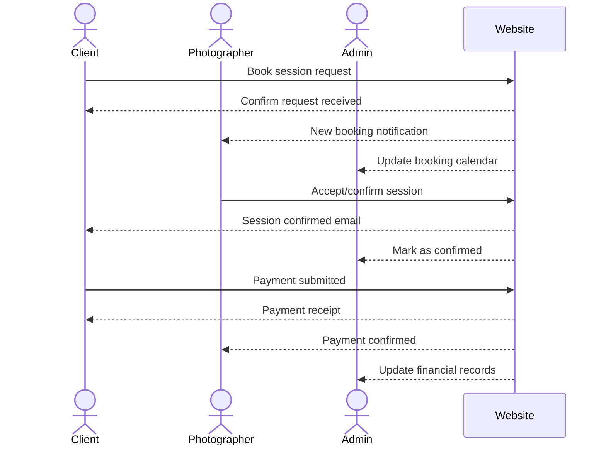

# ASAKA PHOTOS

[My Notes](notes.md)

A full-featured photography website for Asaka Photos (Destination Wedding & Editorial Photography).
Specialty: Destination wedding and editorial photography
Based: Utah, available worldwide
Style: Documentary-style moments captured on film + digital

## Specification Deliverable

### Elevator pitch

Asaka Photos is a destination wedding and editorial photography brand capturing authentic, documentary-style moments in both film and digital. This project creates a custom website that eliminates reliance on third-party booking platforms (like Pixieset, which takes a 5% cut). By managing our own booking, payments, and gallery delivery, we save costs, streamline the client experience, and give couples a beautiful, seamless way to book and relive their special day.

### Design
The website will list package deals, have options for payments, give quotes, and allow a user to login in and book a photoshoot. 

### Key features

Portfolio Showcase – Display curated galleries of wedding & editorial work (film + digital).

Booking System – Clients can check real-time availability and reserve dates.

Payment Integration – Secure transactions using PayPal and Venmo.

Client Login & Galleries – Private client accounts for viewing and downloading delivered photos.

Responsive Design – Optimized for mobile and desktop so clients can book from anywhere.

### Technologies

I am going to use the required technologies in the following ways.

- **HTML** – Structure for portfolio, booking pages, and client galleries.

- **CSS** – Clean, elegant styling that matches the Asaka Photos brand (minimal, modern aesthetic).

- **React** – Dynamic components for portfolio navigation, calendar availability, and gallery viewing.

- **Service** (Node/Express) – Backend service to handle bookings, payments, and gallery delivery.

- **DB/Login** (PostgreSQL + JWT Auth) – Secure login for clients, store bookings, user data, and delivered gallery links.

- **WebSocket** – Real-time booking updates (e.g., calendar instantly updates when a date is reserved).

## 🚀 AWS deliverable

For this deliverable I did the following. I checked the box `[x]` and added a description for things I completed.

- [X] **Server deployed and accessible with custom domain name** - [My server link](https://yourdomainnamehere.click).

## 🚀 HTML deliverable

For this deliverable I did the following. I checked the box `[x]` and added a description for things I completed.

- [X] **HTML pages** - I made a home, schedule, galleries and reviews page
- [X] **Proper HTML element usage** - I used HTML properly following the format
- [X] **Links** - I made links so that we can navigate through the pages
- [X] **Text** - I have text on my html pages
- [X] **3rd party API placeholder** - This is used for the venmo and paypal buttons
- [X] **Images** - I added images to the galleries and the backgroud is an imported image. 
- [X] **Login placeholder** - This part of the project is on the schedule page.
- [x] **DB data placeholder** - This will be added on to the calendar, when a spot is taken it will be crossed out in the calendar.
- [X] **WebSocket placeholder** - I want dates to be crossed off in real time as people schedule a photoshoot. 

## 🚀 CSS deliverable

For this deliverable I did the following. I checked the box `[x]` and added a description for things I completed.

- [X] **Header, footer, and main content body** - I completed this part of the deliverable.
- [X] **Navigation elements** -  I completed this part of the deliverable.
- [X] **Responsive to window resizing** -  I completed this part of the deliverable.
- [X] **Application elements** -  I completed this part of the deliverable.
- [X] **Application text content** - I completed this part of the deliverable.
- [X] **Application images** -  I completed this part of the deliverable.

## 🚀 React part 1: Routing deliverable

For this deliverable I did the following. I checked the box `[x]` and added a description for things I completed.

- [X] **Bundled using Vite** - I ran npm create vite@latest . -- --template react
Which initialized a React project configured for Vite in my existing directory. It created the file vite.config.js, and connected my index.html to the entry point src/main.jsx.
- [X] **Components** - I added an Home.jsx, Schedule.jsx, Reviews.jsx, Galleris.jsx and used App.jsx to match the previous html and css files. Each component imports a css file and uses the same layout structure. These can be found in asaka-react/src/pages.
- [X] **Router** - This can be found in asaka-react/src/App.jsx. I used react router to allow navigation between pages without reloading. 

## 🚀 React part 2: Reactivity deliverable

For this deliverable I used JavaScript and React so that the application completely works for a single user. This is mostly done in the connect tab(schedule.jsx) where a user is able to fill out their request and the day will be blocked out in the calendar. 
- [X] **All functionality implemented or mocked out** - The scheduling and availabilty is saved into local storage. 
- [X] **Hooks** -Used useState and useEffect can be found on the connect page. 

## 🚀 Service deliverable

For this deliverable I implemented backend features to support the frontend functionality.  

- [X] **Node.js/Express HTTP service** - I built an express backend in index.js(in service folder)
- [X] **Static middleware for frontend** - This can also be found in the index.js file. 
- [X] **Calls to third party endpoints** - This is done at the bottom of the home page. Code is found in home.jsx where i fetch https://api.quotable.io/random 
- [X] **Backend service endpoints** -I have backend service endpoints at the end of my index.js file. 
- [X] **Frontend calls service endpoints** - My frontend calls my backend for api/quote and api/bookings. This can be found in api.js in my frontend service folder. 
- [X] **Supports registration, login, logout, and restricted endpoint** - This is used in the schedule page and is supported by api.js in src/services and index.js in service.

## 🚀 DB deliverable

For this deliverable I did the following. I checked the box `[x]` and added a description for things I completed.

- [ ] **Stores data in MongoDB** - I did not complete this part of the deliverable.
- [ ] **Stores credentials in MongoDB** - I did not complete this part of the deliverable.

## 🚀 WebSocket deliverable

For this deliverable I did the following. I checked the box `[x]` and added a description for things I completed.

- [ ] **Backend listens for WebSocket connection** - I did not complete this part of the deliverable.
- [ ] **Frontend makes WebSocket connection** - I did not complete this part of the deliverable.
- [ ] **Data sent over WebSocket connection** - I did not complete this part of the deliverable.
- [ ] **WebSocket data displayed** - I did not complete this part of the deliverable.
- [ ] **Application is fully functional** - I did not complete this part of the deliverable.

- [ ] **Practice** 
"hello world" 
